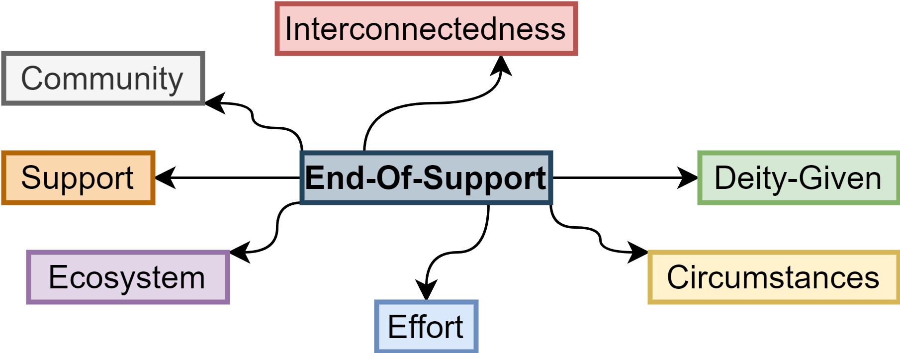
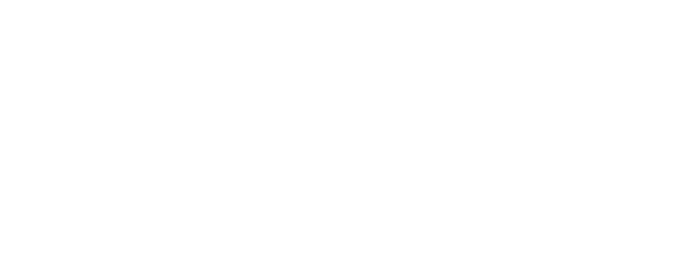

- ***Context***: 
dependency management
<br>
- ***Goal***:
tooling to problem-solve
<br>
- ***Demarcation***:
not full-fletched, rather pioneering

---

# Problem Definition

---

- ***Focus***:
end-of-support dependencies

---

- ***Why***:
risk, expense & cost
in management, development & planning

---

... e.g. **issues** with, and **concerns** about
<br>
- common vulnerabilities and exposures
    - compliance
- stability
    - bugs without fixes or patches
- compatibility
    - out-datedness and actuality

<br>

***-> risk***

---

... **consequenting** 
<br>
- replacement

- upgrades

- independent fixes and patches

<br>

***-> expense & cost***

---

- ***Solution***:
mitigating the impact of consequences 
from end-of-support dependency

---

# Methods

---

- ***What***:
a software solution 
to detect end-of-support dependencies

---

- ***How***:
project-based <> automation <> independence

---

# Results

---

- Theoretical Concept 
<br>
- Requirements Analysis
<br>
- Technical Concept
<br>
- ***deprec*** / ***deprec-cli***

---

# Theoretical Concept

---

***EOS Abstraction Framework***
<br>



---

***EOS Factor*** |&rarr; ***Statements*** |&rarr; ***Signals & Metrics***

---

# Requirements Analysis

---

- applicability in practice
<br>
- suitability for effective use
<br>

***-> project-based & automation***

---

- achieve continuance
<br>
- enable further proceedings
<br>

***-> independence***

---

# Technical Concept

---

- software bill of materials (sboms)
&rarrhk; [CycloneDX](https://cyclonedx.org/)

---

- extraction

---



---

- data model

---

- combination and conclusion

( EOS Abstraction Framework )

---

# deprec

---

- integrating the theoretical concept
<br>
- implementing the technical concept

---

[open source](https://github.com/a-grasso/deprec)

---

written in
<br>


---

supporting dependencies
from
<br>


---

extracting data
from
<br>


## GitHub

---

extracting data
from
<br>


---

# deprec-cli

---

```bash
$> deprec-cli <sbom> <opts>
```

---

[open source](https://github.com/a-grasso/deprec-cli)

---

written in
<br>


---

# LIVE DEMO TIME
